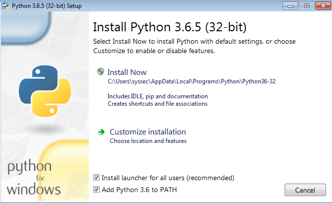
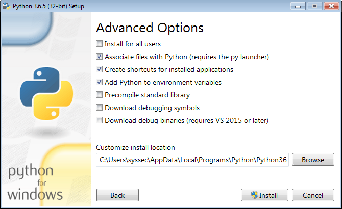

# Python Scripts

## Installing Python 3.6

### Windows

Download the latest version of Python 3.6 from [here](https://www.python.org/downloads/), then run the installer. We will guide you through the installation.



Make sure the option "Add Python 3.6 to PATH" is checked. Otherwise you won't be able to run scripts from anywhere in the filesystem. Choose "Customize installation" for the next step.


The option "pip" has to be checked. All other options are not mandatory, but can be helpful when working with Python. Click "Next" to continue.



The option "Add Python to environment variables" has to be checked. This is required to get access to the Python package management `pip`. Click "Install".

To check if everything was installed correctly type `python --version` into *Powershell*. It should display the Python 3.6 version.

### Linux

**Ubuntu/Debian**

Open you terminal and type

```
sudo apt install python3 python3-pip
```

**Fedora**

Open you terminal and type

```
sudo dnf install python3 python3-pip
```

**Arch Linux**

Everything should already be installed.

## Installing additional requirements with `pip`

Sometimes our scripts depend on packages from the Python repositories. You can check for these requirements by opening the script with text editor. There should be a section at the start of the script that lists the dependencies and gives you the command to aquire them.

```
Pillow is required for image manipulation. Install with pip:

    $ pip install pillow
```

### Windows

Open *Powershell* or `cmd.exe` (only if the former is not installed). Type `python -m` and paste everything after the `$` symbol behind it.

Example:

```
python -m pip install pillow
```

Press Enter. If successful, it will print the following lines.

```
Collecting markdown
  Downloading Pillow-5.0.0-cp36-cp36m-manylinux1_x86_64.whl (78kB)
    100% |████████████████████████████████| 81kB 1.2MB/s
Installing collected packages: pillow
Successfully installed pillow-5.0.0
```

The script can now be used properly.

### Linux

Open the terminal and paste everything after the `$` symbol into the terminal.

Example:

```
pip install pillow
```

Press Enter. If successful, it will print the following lines.

```
Collecting markdown
  Downloading Pillow-5.0.0-cp36-cp36m-manylinux1_x86_64.whl (78kB)
    100% |████████████████████████████████| 81kB 1.2MB/s
Installing collected packages: pillow
Successfully installed pillow-5.0.0
```

The script can now be used properly.

## Running a script

***Windows***: Use *Powershell* or `cmd.exe` (only if the former is not installed) to run python scripts. **Do not** use the *Python Console* that was installed with Python 3. 

Download the script. Open your terminal (Powershell or equivalent on Windows) and navigate to the folder where the script is located. To get an overview of what the script is doing and how to utilize it properly, use the `--help` argument.

```
python3 <filename-of-the-script> --help
```

Replace `<filename-of-the-script>` with the filename of the script you want to run, e.g. `terrain_transform.py`. `--help` will print a short description of every (optional) argument.

Example:

```
$ python3 terrain_transform.py --help
usage: terrain_transform.py [-h] [-i] [--legacy-mode PALETTE_FILE] inputfile

Transforms an image from cartesian to dimetric projection.

positional arguments:
  inputfile             The image you want to transform

optional arguments:
  -h, --help            show this help message and exit
  -i, --inverse         Transforms from dimetric to cartesian
  --legacy-mode PALETTE_FILE
                        Uses BMP instead of PNG as output format and the color
                        PINK (255,0,255) for background instead of the ALPHA
                        channel. Requires an image with the AoE2 palette.
```

*Positional arguments* must be specified when you run the script. *Optional arguments* are not required, but activate different functionality of the script. They sometimes have a short and a long version of which you can choose either (e.g. `-i` and `--inverse` both do the same thing). The first line (`usage`) tells you where you have to put positional or optional arguments. Once you have chosen the arguments, you can run the script from terminal.

Example:

```
python3 --inverse terrain_transform.py TERRAIN.png
```
